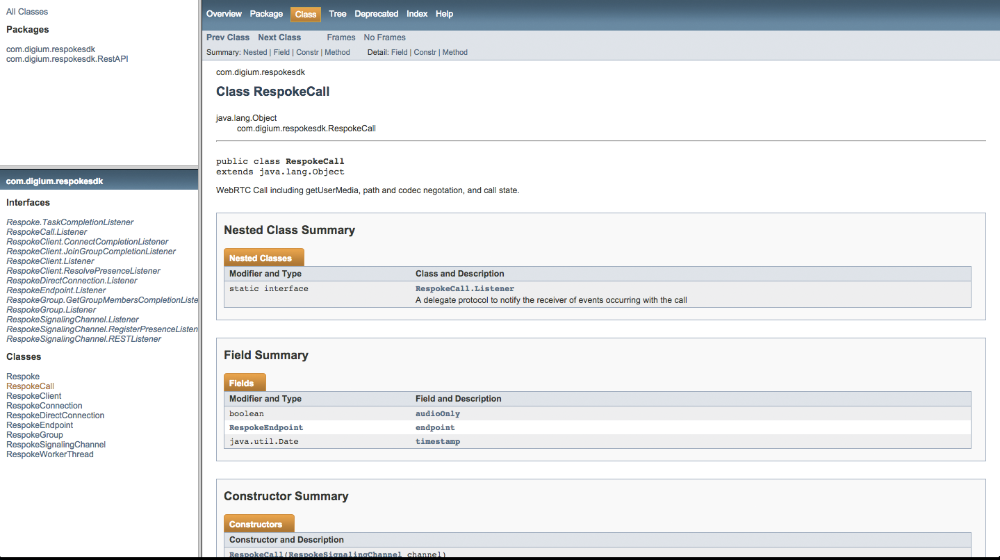

###Android SDK
#Android API Reference

##Overview

Currently, there is no best way to view the API Reference on the maven central respository. Which makes sense since those references are typically consumed by your IDE for IntelliSense, etc. 

The good news is those references are downloaded for you when using maven to [install the Respoke Android SDK](/client/android/getting-started.html). Additionally, IntelliSense just works with Android Studio. This guide is how to download and view the Repoke Android API Reference from the maven central repository.

##Download and Viewing the API Reference

Search the [maven central repository for Respoke](http://search.maven.org/#search|ga|1|Respoke). Download the javadoc.jar file and change the file extension to zip. The final file name will be javadoc.zip. Then unzip javadoc.zip.

Finally, open the index.html file and start viewing the Respoke Android API Reference.

