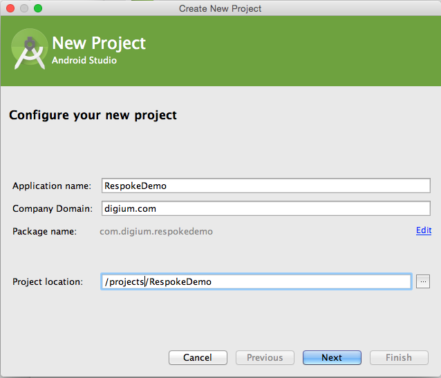
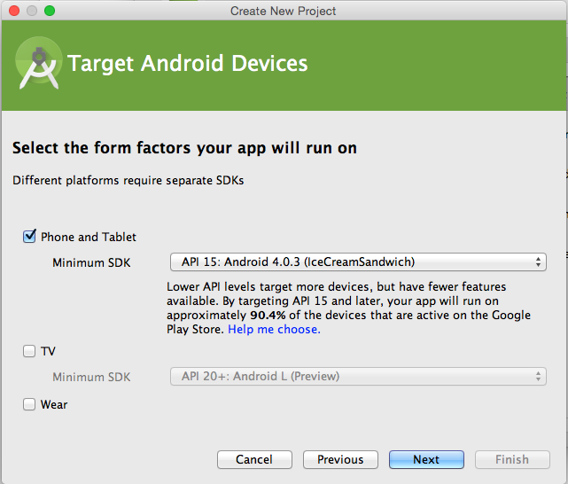
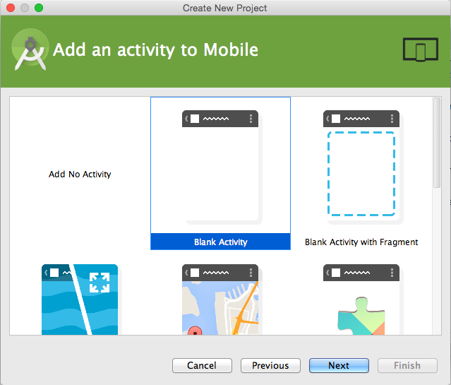
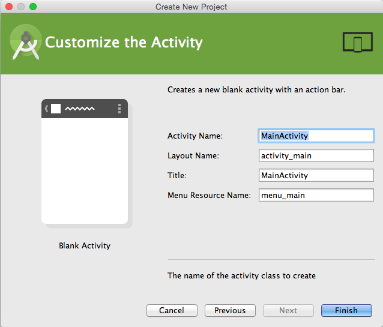
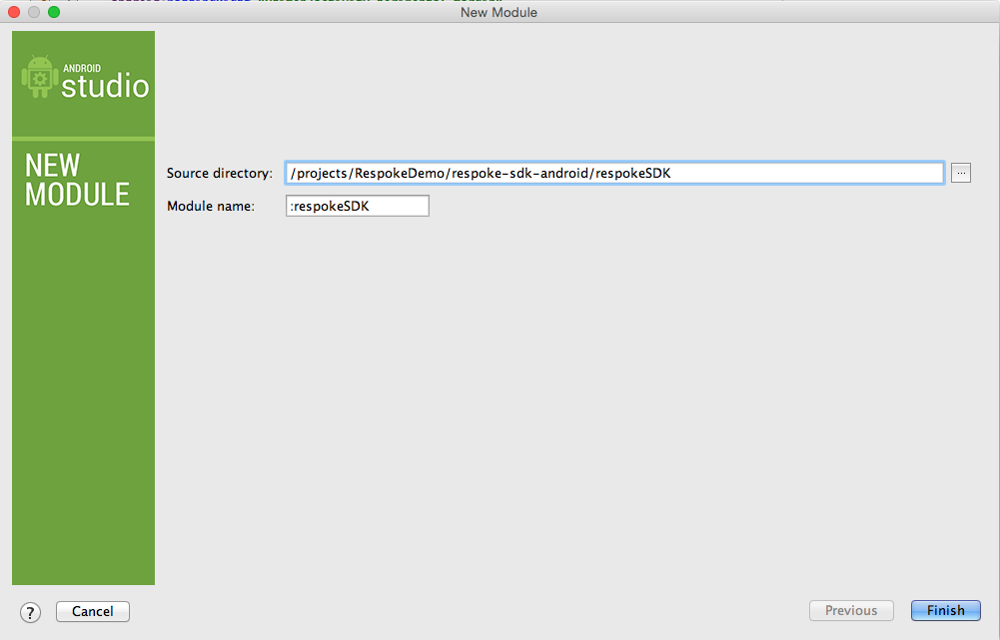

###Android SDK
# Getting Started

## Create an account

First [signup for a free Respoke account](https://portal.respoke.io/#/signup). Within the Respoke Dashboard you can create, manage and delete Respoke Apps. Clicking on a specific App lets you view your App ID, App Secret, whether you have Dev Mode enabled and App Roles (if any).

## Setup Android Studio

### Create a Skeleton Android Project.

First, open Android Studio and create a new blank project based on API level 15 (v4.0.3 Ice Cream Sandwich). Create a blank activity and name it “MainActivity” as shown in the screenshots below.









### Add the Respoke Android SDK

Open a terminal and change into the root directory of your new Android project.

    cd /projects/RespokeDemo/
    
Now unzip the 'respoke-sdk-android*.zip file into this directory or move the resulting directory after unzipping into this directory.

In Android Studio, add the SDK to your project by Choosing **File -> Import Module** and then selecting the base directory of the SDK project in the directory that was cloned ( /respoke-sdk-android/respokeSDK). Android Studio will automatically pull in all of the dependencies and rebuild your project.



### Edit Your Application’s Manifest

The Respoke SDK requires special permissions in order to access the device’s internet connection, camera, and microphone. Open the application manifest for your app and add the items listed below:

```
<?xml version="1.0" encoding="utf-8"?>
<manifest xmlns:android="http://schemas.android.com/apk/res/android"
          xmlns:tools="http://schemas.android.com/tools"
          package="com.digium.respokedemo">
    
    <uses-permission android:name="android.permission.INTERNET" />
    <uses-permission android:name="android.permission.CAMERA" />
    <uses-permission android:name="android.permission.MODIFY_AUDIO_SETTINGS" />
    <uses-permission android:name="android.permission.RECORD_AUDIO" />
    <uses-permission android:name="android.permission.WRITE_EXTERNAL_STORAGE" />
    <application tools:replace="android:icon">
        . . .
    </application>
</manifest>
```

### Edit Your Application’s build.gradle file

Open your application’s /app/build.gradle file and add the Respoke SDK as a dependency.

    apply plugin: 'com.android.application'
    
    android {
        ...
    }
    
    dependencies {
        compile fileTree(dir: 'libs', include: ['*.jar'])
        compile 'com.android.support:appcompat-v7:21.0.3'
        compile project(':respokeSDK')
    }

## Connect to Respoke

Open your application's MainActivity.java class and add the code below to connect to the Respoke service. 

Connecting is performed by instantiating a RespokeClient instance. This class is one of the primary ways you will interface with Respoke and allows you to connect, disconnect, join groups, and more. 

Your application can also be notified of major client-level events by registering as a ClientRespoke.Listener. We will use the onConnect() listener to know when the application has finished connecting to the Respoke service.

```
package com.digium.respokedemo;
. . .
import com.digium.respokesdk.Respoke;
import com.digium.respokesdk.RespokeCall;
import com.digium.respokesdk.RespokeClient;
import com.digium.respokesdk.RespokeDirectConnection;
import com.digium.respokesdk.RespokeEndpoint;
import com.digium.respokesdk.RespokeGroup;
import java.util.ArrayList;
import java.util.Date;

public class MainActivity extends ActionBarActivity implements RespokeClient.Listener {
    public static RespokeClient client;
    private static final String TAG = "MainActivity";
    
    @Override
    protected void onCreate(Bundle savedInstanceState) {
        super.onCreate(savedInstanceState);
        setContentView(R.layout.activity_main);
        
        if (null == client) {
            // Create an instance of the Respoke client
            client = Respoke.sharedInstance().createClient(this);
            client.setListener(this);
            
            // App ID from the Respoke Dashboard for your App
            String appID = "c10a2075-3f3d-466f-82f9-d2285e64c5d4";
            
            // The unique username identifying the user
            String myEndpointID = "spock@enterprise.com";
            
            // Execute some signin event, then connect to Respoke with
            client.connect(myEndpointID, appID, true, null, this.getApplicationContext(), new RespokeClient.ConnectCompletionListener() {
                @Override
                public void onError(String errorMessage) {
                    Log.d(TAG, errorMessage);
                }
            });
        }
    }
    
    . . .
    
    // RespokeClientListener methods
    // "connect" event fired after successful connection to Respoke
    public void onConnect(RespokeClient sender) {
        Log.d(TAG, "Connected to Respoke!");
    }
}
```

Run your application, you should see it successfully connect to Respoke by looking at the LogCat output of your device/emulator:

    02-23 19:14:59.560  10584-10584/com.digium.respokedemo D/MainActivity﹕ Connected to Respoke!


