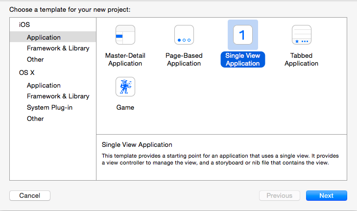

### iOS SDK
# Getting Started

## Create an account

Within the Respoke Dashboard you can create, manage and delete Respoke Apps. Clicking on a
specific App lets you view your App ID, App Secret, whether you have Dev Mode enabled and
App Roles (if any).

## Setup Xcode IDE

### Create an iOS Workspace

Open Xcode and create a new workspace. Now create a new project, supply the project options and
add the project to the workspace.

### Add the Respoke iOS SDK

The Respoke iOS SDK is available to install via [CocoaPods](https://cocoapods.org/pods/RespokeSDK).

Add `RespokeSDK` to your Podfile.

    pod 'RespokeSDK'

Finally, install `RespokeSDK`.

    pod install

That's it.

## Connect to Respoke

Finally, to validate everything is working, you'll want to connect to Respoke:

    #import "Respoke.h"
    #import "RespokeClient.h"

    @interface AppViewController : NSObject <RespokeClientDelegate>
        @property RespokeClient *client;
    @end

    @implementation AppViewController
        @synthesize client;

        - (instancetype)init
        {
            if (self = [super init])
            {
                // Create an instance of the Respoke client
                client = [[Respoke sharedInstance] createClient];
            }

            return self;
        }

        - (void)connect
        {
            // App ID from the Respoke Dashboard for your App
            NSString *appId = @"c10a2075-3f3d-466f-82f9-d2285e64c5d4";

            // The unique username identifying the user
            NSString *endpointId = @"spock@enterprise.com";

            // Execute some signin event, then connect to Respoke with
            [client connectWithEndpointID:sendpointId appID:appId
                                 reconnect:YES initialPresence:nil
                                 errorHandler:^(NSString *errorMessage) {
                [self showError:errorMessage];
            }];
        }

        // "connect" event fired after successful connection to Respoke
        - (void)onConnect:(RespokeClient*) client
        {
            NSLog(@"Connected to Respoke!");
        }
    @end

That's it! Now we're ready to start using all Respoke has to offer.
