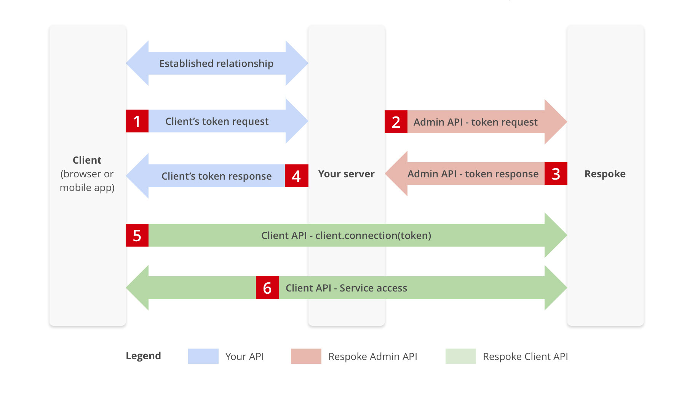
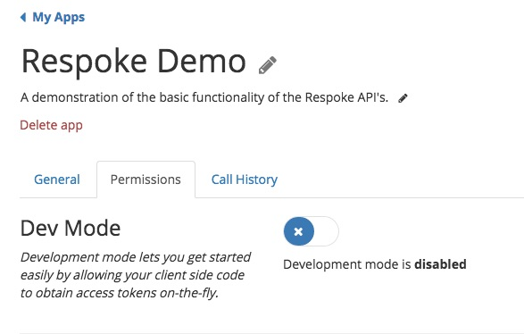
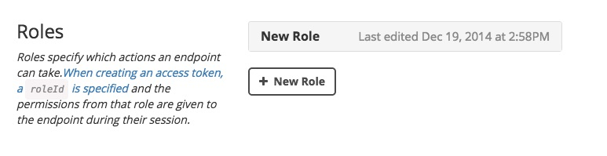

### JavaScript Library

# Authentication
Connecting to Respoke requires an access token which provides both authorization and permissions for your users. This token can be obtained using a method known as `brokered authentication`. 

## Brokered Authentication
When development is complete and you're ready to put your app into production, you will need to lock things down for security purposes. To accomplish this you'll setup `brokered authentication` which uses a server-side script to verify users and request a token on their behalf. This not only secures your application by storing sensitive information on the server, it also gives you a greater level of control over your users permissions. The general process for `brokered authentication` is as follows:

The first step in setting up `brokered authentication` is disabling Development Mode for your app. This can be accomplished by setting the Dev Mode toggle to disabled in the permissions tab of your app settings.

## Creating Roles

Once Dev Mode has been disabled for your app, you will notice a new section titled `Roles` under the permissions tab in your application settings. Roles are used to assign permissions to users or groups of users for your app.

### To create a new role or to update an existing one:

1. Go to your app in the [Respoke Dashboard](https://portal.respoke.io/#/apps/).

2. Select your app.

3. Ensure that development mode is set to disabled.

4. Create a new role or click on an existing role to set the name, permissions, and other settings for that role.

5. Take note of your appId, appSecret and new roleId.

Respoke and your app are now set up for authentication. It's time to write some code.

## Authenticating With Respoke

First, request a `token` from your server. 

When you request a token, you need to provide:

- `endpointId`: Usually your user's username
- `appId`: The App ID for your App
- `appSecret`: The App Secret for your App
- `roleId`: A set of permissions you create in the Respoke Dashboard for your App
- `ttl`: The number of seconds the token is valid

    // Create an instance of the Respoke client
    var client = respoke.createClient();

    // Create HTTP POST request to authentication server
    (function connect() {
        $.ajax({
            method: "POST",
            url: "your/server/api/tokens",
            data: {
                endpointId: "spock@enterprise.com"
            },
            success: function(response) {
                var token = response.token;

                client.connect({
                    // Always obtain a new token each time and use it immediately.
                    // It may only be used once, and it has a very short lifetime
                    // to be activated.
                    token: token
                });
            }
        })
    })();

    // "connect" event fired after successful connection to Respoke
    client.listen("connect", function(e) {
        console.log("Connected to Respoke!", e);
    });

Then your server will request a `token` from Respoke.

{example: endpoint-authentication}

Use this `token` to connect your client to Respoke.

Additionally, you'll need to listen to the `disconnect` event. Then request a new `token` from your server and use this new `token` to re-connect your client to Respoke.

    client.listen("disconnect", function (evt) {
        // Reconnect to Respoke
        connect();
    });

