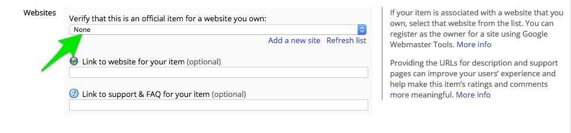

#Adding Screen Sharing to Your App

In this guide you’ll learn how to add screen sharing capabilities to your application. This feature allows you to share a video stream of your screen with another user. It is very easy to setup; however, due to the security restrictions that are currently imposed by Google, there are a few steps that you will need to take to get everything up and running. But not to worry, we’ll walk you through everything below.

*Note: At this time you must be using the Chrome browser and install an additional Chrome extension in order to share your screen with another user (more on how to configure this below). The recipient of the Screen Share however, can use any WebRTC enabled browser. Support for additional browsers will be added in the future.*


###Assumptions
* You have reviewed the [Getting Started With Respoke Guide](https://docs.respoke.io/) and are familiar with creating an instance of the Respoke `Client` object.
* Have a Respoke account
* Have an app ID
* Have a basic understanding of Javascript and JQuery


##Setting up HTTPS
The current security restrictions for screen sharing require that your files be served over HTTPS. If you are using a service such as [Heroku](http://herokuapp.com/) which takes care of serving your files over HTTPS, or you have created your own server environment which uses HTTPS, then you can skip this section.

If you are just looking to test out the functionality of screen sharing on your local machine, and don't already have HTTPS setup, then you may want to consider using [ngrok](https://ngrok.com/).

###Testing locally with HTTPS using ngrok
[ngrok](https://ngrok.com/) provides a simple means of exposing your local web server to the internet over HTTPS. To accomplish this, you will need to download the ngrok binary for your operating system at [https://ngrok.com/download](https://ngrok.com/download). Once you've download the ngrok binary, you will need to run it from the command line by navigating to the directory where you've stored the binary, then running the command 

```
./ngrok port_number
```

where port_number is the port that you are using for your local server (for example: Port 80). You should then see a list of information about the connection that ngrok has established. The piece you are going to be looking for is the HTTPS url (it should look something like https://9d621f9.ngrok.com). This is the URL that you will be able to use to access your local web server over HTTPS.


Congratulations! You now have your local files being served over HTTPS and are ready to move on to creating the Chrome extension that will allow your users to share their screens.


##Creating the Chrome Screen Sharing Extension
In order to use the screen sharing functionality in the Chrome browser, you are currently required to first install a Chrome Extension. We've already created the extension for you, but since Chrome extensions function on a domain basis, you will need to create (fork) a copy of the extension and set it up for the domain your application is going to be hosted on.

The process is slightly different depending on whether you're working in your local (testing) environment, or hosting your application on a domain, but the first few steps are the same:

1. Download or fork the Respoke Chrome extension at: [https://github.com/respoke/respoke-chrome-extension](https://github.com/respoke/respoke-chrome-extension). 

2. Follow the instructions in the README file included with the extension source code to make the manifest.json file, change the name of your app, and list the domain(s) where your app will run.

Once you have a copy of the Respoke Chrome Extension with the updates outlined above, follow the instructions for either local testing or hosted applications below.


###Local Testing
If you would like to test out the screen sharing functionality in your local development environment you will need to do the following:


1. Open Google Chrome and select Window -> Extensions, or just type *chrome://extensions/* in the address bar and hit enter.
2. Check the box labeled *Developer Mode*.
3. Click the *Load unpacked extension...* button, navigate to the directory where you have stored your extension files, and click the select button.


That's it for setting up the extension for local testing! Head down the last section *Adding Screen Sharing to Your Application* to get to the fun part: the code!

###Hosted Applications
Once you are ready to host your application on a domain,  you will need to upload the extension to the Chrome Webstore and either prompt your users to install the plugin directly from the Webstore or use *inline installation*, which allows for installation direclty from your site. 

Detailed instructions on publishing your extension to the Chrome Webstore and using inline installation can be found at [https://developer.chrome.com/webstore/publish](https://developer.chrome.com/webstore/publish) and
[https://developer.chrome.com/webstore/inline_installation](https://developer.chrome.com/webstore/inline_installation), but I will cover the basics below:

1. Create a .zip file containing the files located in the Respoke Chrome Extension directory you created earlier.
2. Go to [https://chrome.google.com/webstore/developer/dashboard](https://chrome.google.com/webstore/developer/dashboard) and click on *Add new Item.*
3. On the next page, click the "Choose File" button, and selet the .zip file you created in step 1.
4. Click the *Upload* button.
5. After the upload completes you will be taken to a page where you can configure the options for your extension. Under the section labeled *Websites* you will want to be sure to select your domain from the dropdown list (the default value is set to "none"). If the domain where you will be hosting your application is not listed, then you will need to first add the domain by clicking on the *Add a new site* link.



After your extension is available on the Chrome Webstore you need to add a bit of code to check if your users have the extension installed, and if not, to help them install it.

The following snippet will first check to see   the users browser supports Screen Sharing, then check if they have already installed the the Chrome Extension that you created.

```
 if (respoke.needsChromeExtension && !respoke.hasChromeExtension) 
 {
     chrome.webstore.install(myExtensionURL, onSuccess, onFailure);
 }
```
This is what is know as "inline installation," or allowing your users to install the extension directly from your site. One piece of the inline installation that can be a bit tricky is getting the extension URL (called *myExtensionURL* in the example above). The base url is always going to be *https://chrome.google.com/webstore/detail/* followed by the ID of your extension. To get the ID, go to [https://chrome.google.com/webstore/developer/dashboard](https://chrome.google.com/webstore/developer/dashboard) and click on the name of your extension. This will open the extensions' page, and the ID value for that item will be shown in the browser address bar; it is a string of 32 Latin characters at the end of the URL in the address bar. 


Just copy the ID from the end of the URL and paste it after *https://chrome.google.com/webstore/detail/* and you have your extensionURL. 

More info. on inline installation can be found at: [https://developer.chrome.com/webstore/inline_installation](https://developer.chrome.com/webstore/inline_installation).


##Adding Screen Sharing to Your Application
Once you have HTTPS working and have your Chrome Extension in place, it's time for the fun stuff: the code!

Adding screen sharing to your application is actually quite easy. You need a reference to the Endpoint you want to share your screen with

```
var recipientEndpoint = client.getEndpoint({ id: recipientId });
```


a couple of `<video>` objects to attach the streams to

```
<video id="localVideoElement"></video>
<video id="remoteVideoElement"></video>
```


and a listener for the call event.

```
client.listen('call', function(evt) {
    activeCall = evt.call;

    // We only want to answer if we didn't initiate the call
    if(activeCall.caller !== true) {
        var localVideoElement   = document.getElementById('localVideoElement');
        var remoteVideoElement   = document.getElementById('remoteVideoElement');

        activeCall.answer({
            videoLocalElement: localVideoElement,
            videoRemoteElement: remoteVideoElement
        });

        // The hangup event indicates the call is over
        activeCall.listen('hangup', function () {
            // Cleanup the UI
        });
    }
});

```

Then we call the `startScreenShare()` method to initiate the share

```
var localVideoElement   = document.getElementById('localVideoElement');
var remoteVideoElement   = document.getElementById('remoteVideoElement');

activeCall = recipientEndpoint.startScreenShare({
    videoLocalElement: localVideoElement,
    videoRemoteElement: remoteVideoElement
});
```

If you get stuck, or have additional questions, head over to the [Respoke Community Forums](http://community.respoke.io/) for help.


 
