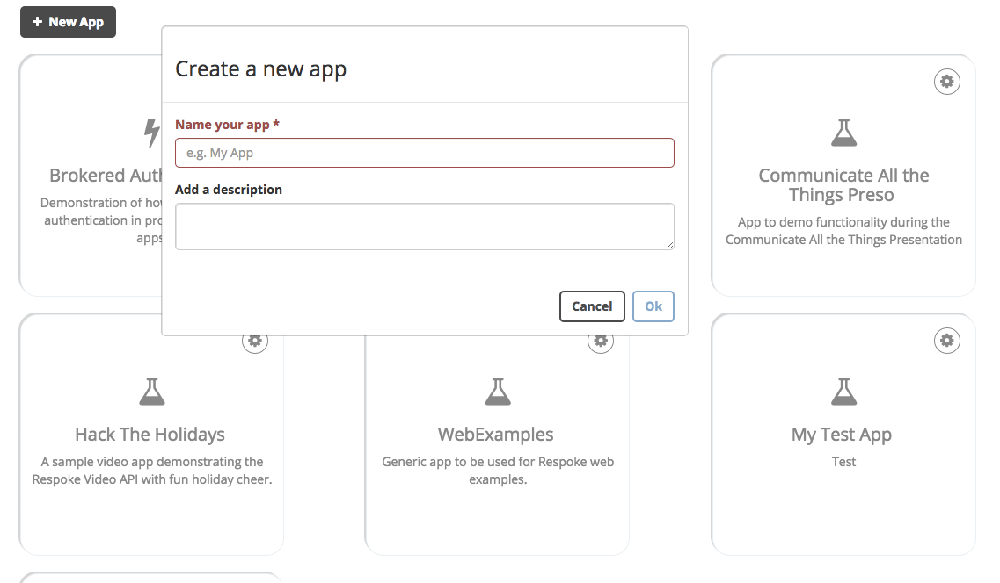
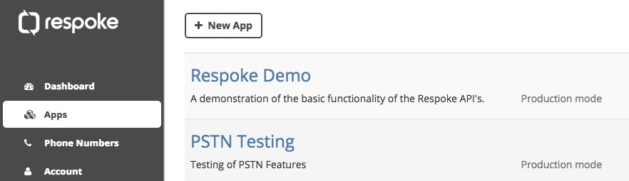
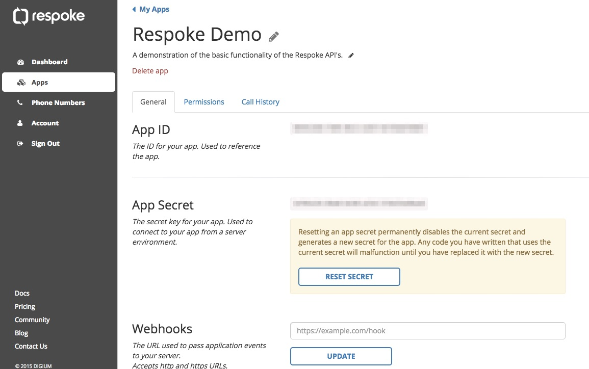

### Respoke Dashboard

# Apps
Apps in Respoke act as containers which house the user permissions and other configuration settings for a specific application. This allows you to create multiple applications each with unique settings and permissions. You create and manage your apps in the <a href="https://portal.respoke.io/#/apps" target="_blank">Apps tab of the Dev Portal</a>.

## Creating an App
To create a new Respoke app head to the <a href="https://portal.respoke.io/#/apps" target="_blank">Apps tab of the Dev Portal</a> and click the `New App button`. Provide a name and description for your app and click Ok.

## Managing an App
You can change the settings for your app, as well as obtaining app specific information such as the App ID and App Secret, by clicking on any of the apps in the <a href="https://portal.respoke.io/#/apps" target="_blank">Apps tab of the Dev Portal</a>. 

This will take you to the settings page for the App you selected. From here you can view and configure all the of settings for the app.

