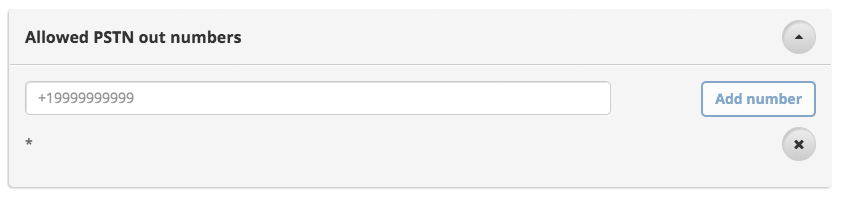
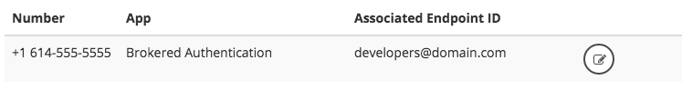
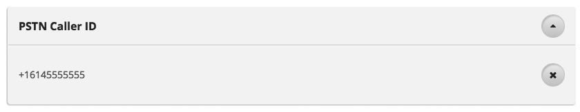

### Respoke Dashboard
# Phone Numbers

## Overview

In order to [place calls](/client/javascript/guide/phone-calling.html) to a phone number, your endpointId must
[authenticate](/client/javascript/guide/authentication.html) using a role which has PSTN (phone) calling enabled.

## Enabling Phone Calling Features

First, specify a phone number or group of phone numbers that the endpoint is allowed to call. Alternatively, you can
specify "*" to allow calling to any phone number.

Next, choose a phone number from the "Phone Numbers" section.

Finally, assign the phone number to an App Role.

That's it. You're all set to call phone numbers and display callerId for outgoing phone calls.
