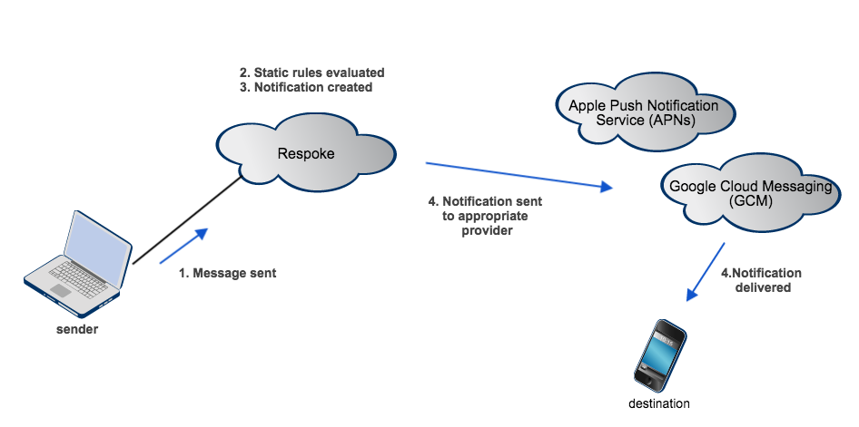
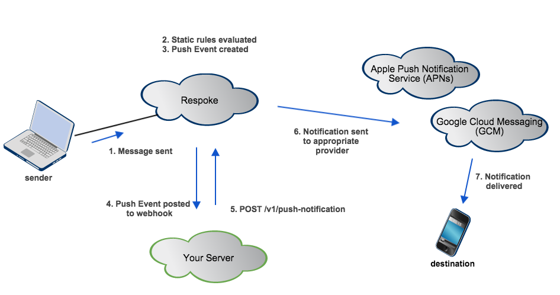
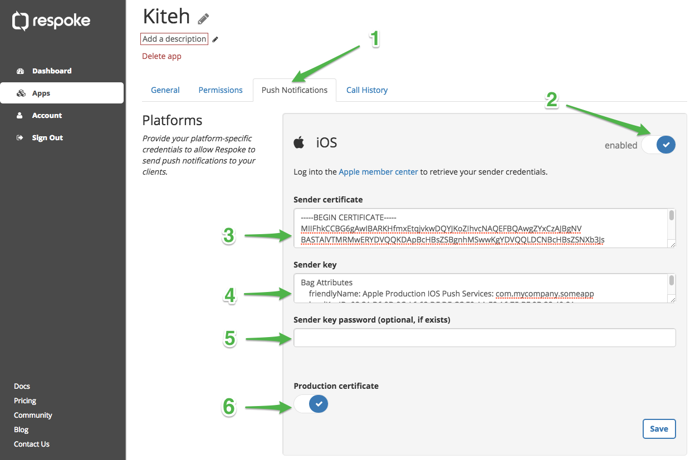
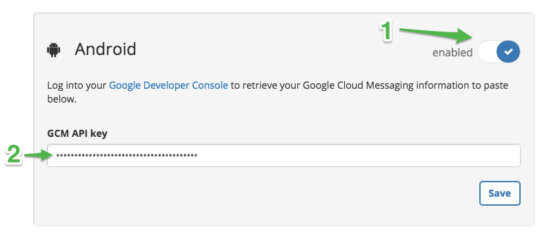
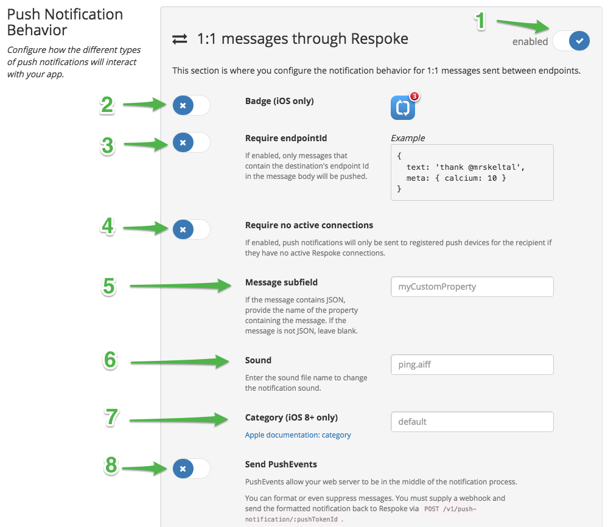
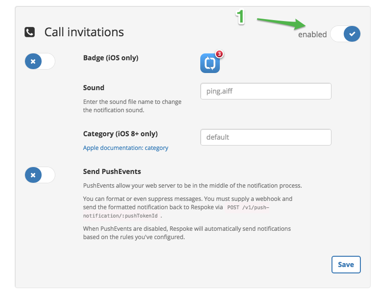
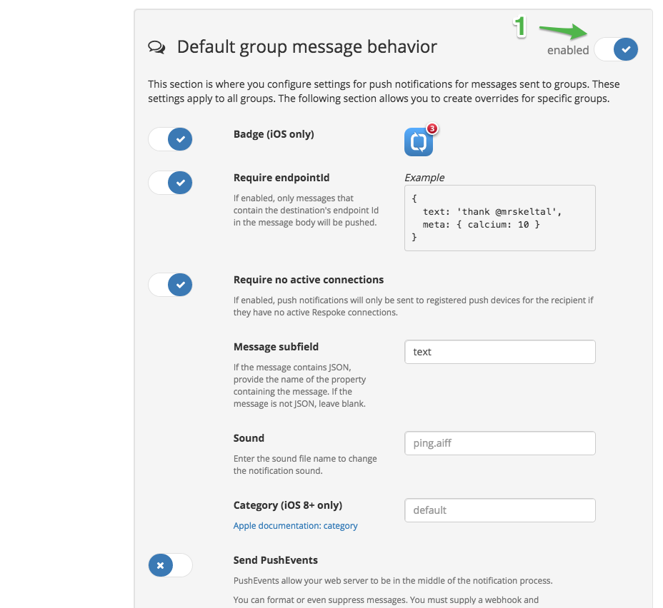
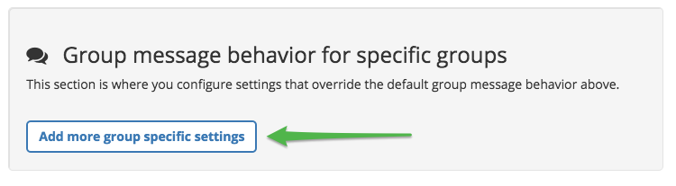
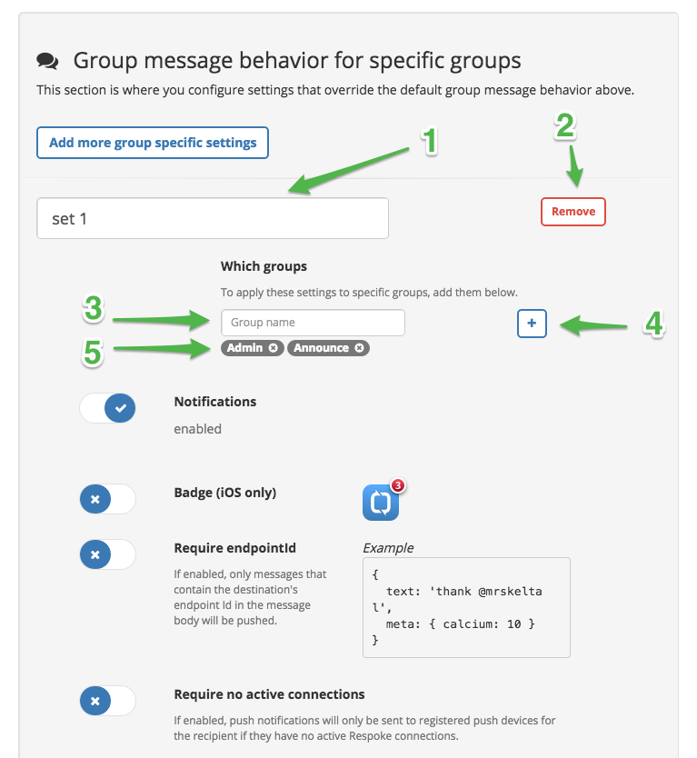

###Respoke Dashboard
# Push Notifications

## Introduction
Push Notifications are messages sent to mobile devices to alert the user that a message has been received while your
mobile app was in the background. Respoke can send notifications on your application's behalf based on the configuration
parameters set in the portal in an automated fashion. And if you want more control over the push process, you can
optionally configure Push Events that Respoke will send to your server's webhook instead of sending the notification
automatically, allowing your server to decide whether to send a notification and how to format the notification. You can
even use fully automated notifications and Push Events simultaneously for different types of messages. Whether using
automatic notifications or Push Events, your mobile app will need to register its push token with Respoke as part of the
connection process. The steps involved for this can be seen in the sample mobile apps. This page describes the
configuration that is required in the development portal to enable push notifications.

NOTE: We currently support Apple Push Notification Service (APNs) for iOS devices (iPhones and iPads) and Google Cloud
Messaging (GCM) for Android phones and tablets. You can enable either or both services. Please let us know other
platforms you'd be interested in.

## Respoke Push Support

Respoke provides a tremendous amount of flexibility with its push notification support for mobile devices. Configuration
is oriented around the Respoke message types, and each type can be configured differently. The Respoke message types
are:

- 1:1 messages. These are messages sent from one endpoint to another. This type of messaging is often used for private
conversations, similar to SMS.
- Calls (aka. Signals). These are messages that indicate the sender is trying initiate an audio or video call with the
intended recipient.
- Group messages. This is Respoke's term for publish/subscribe (aka. pubsub) messaging. The sender sends a message to a
group, and the recipients are any endpoints that are members of that group.
- Presence. We currently don't support pushing notifications for presence as it seems like a peculiar use-case. Talk to
us if you feel otherwise!

For each message type, you can configure:

- Enabling or disabling push notification for the given message type.
- Automatic push notifications based on simple rules using configuration specific to each message type.
- Push Events that notify your server's webhook, allowing your server to make the decision on whether or not to push a
notification, format the notification, and provide overrides for the configuration data.

### Automatic Push Notifications
The automatic notification support is the simplest to get started with. For each message type, you simply use the
Respoke developer portal to configure basic information to apply and the rules under which you wish to send
notifications. The rules currently supported are:

1. Require that the destination's endpointId is embedded in the message text.
This is useful if you want to limit notifications to those where direct "mentions" of the destination endpoint are part
of the message. For example: If Alice and Ted are endpointIds and this rule was applied, Alice would receive a
notification for a message that said: "Make sure we include Alice and Ted in the marketing presentation."
1. Require that the destination have no active connection to Respoke. This rule would stop notifications when the user
had the mobile app open (connected by websocket) or when a user connected using the same endpointId via a web client.
1. Require the presence of a subfield within a JSON blob. This rule causes the message to be parsed on the assumption
that it is JSON, and if successfully parsed, the actual notification text is pulled from the named subfield from the
resulting object. When this rule is enabled, a message that isn't parseable or doesn't have the named property is
ignored.



### Push Events
The Push Event support allows your server to be involved in the push process to apply dynamic rules and formatting.
When using Push Events, the rules that you chose to apply are still applied (step 2 in the diagram below). This allows
you to cut down on pointless network traffic and load on your server. Notice that step 3 in the process is to create a
Push Event rather than the actual notification. This event is posted as an App system event, which means it can be
delivered to a registered web hook, or to any endpoint that your application has listening for system events.

The Push Event that is posted contains:

- The original message that triggered the event
- The config that applies to the given message type
- The notification message formatted as Respoke would have sent if you were using automatic mode.

More explicitly, the event has this form:

```js
{
	header: { type: "pushEvent" },
	originalMsg: { /* <original message> */ },
    pushText: "<notification that would have been pushed in automated mode>",
	cacheId: "<uuid>",
	pushNotificationId: "<uuid>",
	endpointId: "<destination's endpointId>",
	config: { /* <config for the given message type> */ },
	time: /* <timestamp> */
};
```



Your server can then apply it's own format to the notification message, override any of the config parameters, and then
cause the push to happen via a `POST` to the `/push-notification` route (step 5, above). The parameters are:

```js
{
    originalMsg: { /* <original message> */ },
    pushText: "<required... the text to use in the notification.>",
    cacheId: "<required if present in the Push Event>",
    badgeEnabled: /* <optional boolean> */,
    badgeCount: /* <optional integer> */,
    category: /* <optional... only for iOS 8 and above> */,
    soundFile: "<optional>"
};
```

The use of Push Events can be decided for each message type independently.  So you could, for example, use Push Events
to customize messages to groups, but allow Calls to be handled by Respoke in an automated fashion.

To help you get started handling Push Events, a sample app is available on GitHub at
[respoke/sample-push-server](https://github.com/respoke/sample-push-server).

## Configuring Push Notifications in the Portal

In the Respoke developer portal, select the App for which you wish to configure push notifications. Then select the tab
labeled Push Notifications (see callout 1 below). If you do not see this tab, Push Notifications haven't been enabled
for your account, most likely because we're in a beta state with Push Notifications. Contact us by email at
[info@respoke.io](mailto:info@respoke.io) if you'd like to participate in the beta program.

### iOS notifications

For your iOS app to receive push notifications, you'll need to select the ***enabled*** toggle (callout number 2) and
provide your APNs credentials. Detailed instructions for how to generate your APNs credentials can be found
[here](/client/ios/ios-push-notification-credentials.html).

Once you've generated your APNs credentials, paste them into the fields provided (callouts 3 and 4). The `cert.pem`
contents should be pasted into ***Sender certificate*** field and the `key.pem` contents (in its entirety) into the
field labeled ***Sender key***. When you generated the key file, you had the option of password protecting the file or
not. If you used a password enter that into ***Sender key password*** field.

Apple allows you to use a development provisioning profile for the developer that built the mobile application.
If you're using a development provisioning profile, leave the ***Production certificate*** item unchecked.
For Ad-hoc or Production provisioning profiles, you must ensure the ***Production certificate*** check box (callout 6)
is enabled.



### Android Notifications

To enable notifications to Android devices, select the ***enabled*** control in the Android section. Paste your GCM API
key. As shown at callout 2, the value will be hidden once you click outside the input field. Detailed instructions for
how to generate your API key, including configuring your app to accept push notifications from Respoke servers, are
available [here](/client/android/android-push-notification-credentials.html).



### Message Type Configuration

Push notifications can be set independently for 1:1 messages, group messages and for calls (used to initiate audio or
video sessions). Each of these three types can be enabled or disabled, and have other customizable settings as show
below.

#### 1:1 Message Configuration

For 1:1 messages (i.e. messages sent from one endpoint to another) the following configuration options are available.
 1. Push notifications can be enabled or disabled. (You only see the other configuration options when enabled.)
 1. Badge - Whether or not 1:1 messages increment the badge counter.
 1. Require endpointId - Whether or not the destination's endpointId is required to be in the message body in order for
 the push to occur.
 1. Require no active connection - When this is enabled, a notification is only sent when there are no websocket
 connections to Respoke for the given endpointId.
 1. Message subfield - If set, this field should identify a subfield within the message body, which will be assumed to
 be a JSON structure. For example, if the message has a property named "text" that contains the actual message content,
 you would enter "text" here. If you set a value here that doesn't appear in the message (or the message is not valid
 JSON), no notification will be sent. If you leave this configuration blank, the entire message body will be used as the
 notification text.
 1. Sound - Enter the name of the sound file to play with the notification. The sound files available depend on your
 mobile application.
 1. Category - This field only applies to Apple iOS devices. Enter a custom notification category or leave it blank to
 use the default.
 1. Send Push Events - When disabled, Respoke will automatically construct the notification and send it (assuming the
 rules from items 3, 4, and 5 above have been met). When enabled, Respoke will generate a Push Event that your webhook
 or administrative websocket can listen for (also contingent on the rules define in item 3, 4 and 5.) Using the contents
 of the Push Event, your application can decide whether or not to push the message, format the message how you wish,
 override the configuration properties defined here, and initiate the push by a call to the Respoke API. An example Push
 Event server application is available [on GitHub](https://github.com/respoke/sample-push-server) that demonstrates this
 process.



#### Call Configuration

For calls (i.e. messages sent to initiate an audio or video call) the following configuration options are available.

 1. Push notifications can be enabled or disabled. (You only see the other configuration options when enabled.)
 1. Badge - Whether or not 1:1 messages increment the badge counter.
 1. Sound - Enter the name of the sound file to play with the notification. The sound files available depend on your
 mobile application.
 1. Category - This field only applies to Apple iOS devices. Enter a custom notification category or leave it blank to
 use the default.
 1. Send Push Events - When disabled, Respoke will automatically construct the notification and send it. When enabled,
 Respoke will generate a Push Event that your webhook or administrative websocket can listen for. Using the contents of
 the Push Event, your application can decide whether or not to push the message, format the message how you wish,
 override the configuration properties defined here, and initiate the push by a call to the Respoke API. An example Push
 Event server application is available [on GitHub](https://github.com/respoke/sample-push-server) that demonstrates this
 process.



#### Group Configuration

Group messages (i.e. messages that were published to a group for pubsub distribution) have a default configuration and
optional overrides for specific groups. A default configuration is useful so that you don't have to name every
conceivable group, especially since your app may dynamically manage groups.

For the default group behavior, the toggle that enables or disables notifications (see callout 1) determines whether or
not group messages will be sent as push notification by default. In other words, when enabled, the other default group
configuration settings become visible, and those settings are applied to any group not defined in an override set (as
explained in the next section). The configuration settings available when default group notifications are enabled are
identical to those described above for 1:1 messages.

When disabled, you only have notifications sent for groups explicitly configured in the group sets in the next section
(explained below).



#### Overrides for specific groups

If you have specific groups that you'd like to define special configuration that is different from defaults defined in
the previous section, select the ***Add more group specific settings*** button.



You can name the set (as shown by callout 1). For this set of configuration data to be useful you should add one or more
group names. Enter the group name (see callout 3) and select the "add group" button (callout 4). The names will appear
below (see callout 5... the Admin and Announce groups were added in this manner).  Add as many groups as you wish and
then configure this set as needed.The configuration options for this set are identical to those described for 1:1 message
configuration.

You can add as many override sets as needed. Each set can have one or many group names associated with it. If you
associate a given group name with more than one set of overrides, it is indeterministic as to which set of configuration
properties will be applied.

The remove button (shown by callout 2) will remove this set of configuration if you wish to revert back to the default
group configuration.




