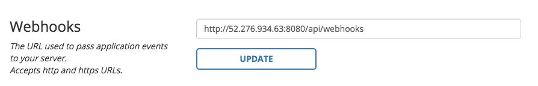

###Respoke Dashboard
# WebHooks

## Overview

WebHooks enable Respoke to send your server JSON messages when events occur in your app. Those events can be anything from a user connecting to your Respoke app, to a user joining a group.

## Enabling WebHooks

First, specify a URL to pass application events to your server.



Next, setup your server to recieve WebHook events from Respoke. Here is an express server running on Node.js

      var express = require('express');
      var app = express();
      var bodyParser	= require('body-parser');

      app.use(bodyParser.urlencoded({ extended: true }));
      app.use(bodyParser.json());

      var port = process.env.PORT || 8080;

      // API Routes
      var router = express.Router();

      // Create a WebHook route (accessed at POST /api/webhooks)
      router.route('/webhooks')
      	.post(function(req, res) {
      	    console.log(req);
      	});

      // Register our routes
      app.use('/api', router);

      app.use(express.static(__dirname + '/app'));

      // Start the server
      http.createServer(app).listen(port);


Finally, parse the events on your server - Here's the callback from joining a group.

```
body: { 
  header: { 
    channel: 'event_',
    type: 'groupJoined',
    from: 'system',
    fromConnection: 'system',
    requestId: '7da649fe-bca7-4d2d-92a1-20caa679bfd4' 
  },
  endpointId: 'spock@enterprise.com',
  connectionId: 'C33794C7-1679-4782-8E7C-789FE44841A3',
  appId: '63c52041-5e91-456b-b450-48926feb3964',
  time: 1431130312,
  group: 'announce_'
}
```

That's it. Using WebHooks with Respoke is easy.