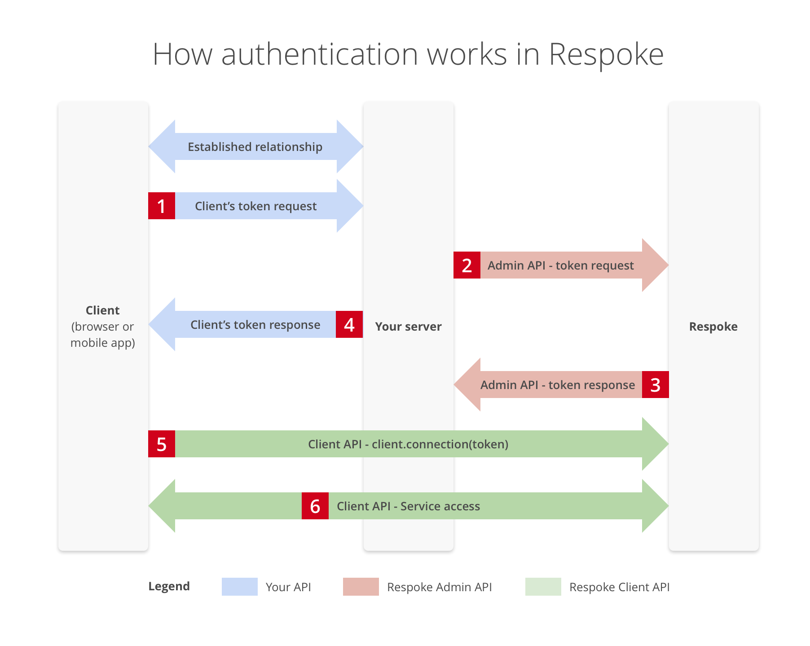

# Authentication

## In this article
* understand how you can control access to Respoke in your application
* learn about *development mode*
* get an overview of the back-and-forth authentication process of obtaining a token

## What is brokered authentication?

Your users need an access token to connect to Respoke.

The access token provides both authentication of **who they are** and authorization of **what
they are allowed to do**. When you use the Admin API to create a token for a user, you specify
these things. The exception is that when your app is in *development mode*, endpoints can
directly create access tokens without verification. They don't need you to request a token
for them - they can do it themselves.

*Development mode* makes getting started easy, but is inherently insecure. In production, you need
a server to verify users and [request a token on their behalf using the Admin API's endpoint authentication](/api/authenticating.html#endpoint-authentication). This gives you fine-grained
control over users and permissions.

## How do I get a token for one of my end users?

When you request a token, you need to provide:
* an endpoint name - `endpointId` - usually their username in your app
* a set of permissions - `roleId` - you create this in the
[Respoke developer console](https://portal.respoke.io) under an application
* how long it is valid - `ttl` - the number of seconds to let this endpoint be authenticated to
Respoke.

In the simplest case, you could provide us an endpoint name and request all permissions. Once
you receive a token, you provide this back in response to your user's original request. They use
the token (actually, the `tokenId`) to request the authentication access token you created for them.

## How authentication works in Respoke

## Step-by-step guide to brokered authentication in Respoke

### Assumptions

You already have a relationship with your end users to manage usernames, passwords,
and permissions.

### 1. Client's Token Request

Your user makes a request to your server, asking for a Respoke token.

### 2. Admin API - Token Request

When your server receives the request for a token, it makes a token request to Respoke, adding the **App Secret Key** as a header, a time-to-live (ttl) in seconds to ensure tokens can't be used very much later, and a named identifer also known as an "endpoint id". This can be a random string but is often a username for simplicity. The `endpointId` is how the user will be known by Respoke, when they connect with the provided token response. You'll also provide the id of a role representing a set of permissions that Respoke will use to allow or protect certain actions attempted by this endpoint. Roles can be created in your [Dev Console](https://portal.respoke.io/), and there is more information about working with roles in the [roles tutorial](/tutorials/roles-and-permissions.html).

Here are a few examples of how to get this done programatically:
    
{example: endpoint-authentication}

### 3. Client's Token Response

Your API responds to the user request in step 1. The only thing you need to return is the `tokenId`.

**Important note:** For security, the `tokenId` will only live for a few seconds. The `ttl` is applied
to the session `token` after your user requests it with the `tokenId`.

### 4. Client API - `client.connect()`

**JS Client Library Method**

Using the [Respoke JS library](/js-library/respoke.html) on the client to connect to Respoke using the token would look like.

    client = respoke.createClient();

    client.connect({
        token: tokenId
    });

### 5. A note about automatic reconnection

A new token is required on every connection. Because of this, when using brokered auth you'll need to listen to the `disconnect` event and fetch a new token. Then use this new token to reconnect.

    client.listen('disconnect', function () {
        // trigger your code which fetches a token from your server
        getNewToken(function onSuccess(token) {
            client.connect({
                token: token
            });
        });
    });
