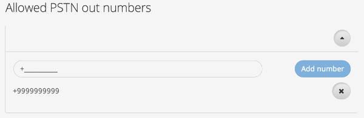
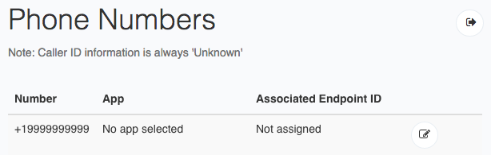

# Calling to and from a phone

You can use Respoke to call and receive calls from phones as well as other Respoke endpoints. In this tutorial, you will learn how to configure your app to accept phone calls and how to place calls to a phone.

### Assumptions

1. You have a Respoke account and an app ID.
2. You have configured your account and web server for [Brokered Authentication: Securing Your Application](/tutorials/brokered-auth.html).
3. You have [signed up for beta access to PSTN calling](http://community.respoke.io/t/sign-up-now-for-our-pstn-beta/65).
4. You have [created a role](/tutorials/roles-and-permissions.html).


### Step 1: Setting up your Role

In order to place calls to a phone number, your endpoint must be using a role which has PSTN (phone) calling enabled. This is done by specifying a phone number or group of phone numbers that the endpoint is allowed to call. Alternatively, you can specify "*" to allow calling to any phone number.

[](enable-phone-calling.png)

### Step 2: Calling a Phone Number

Now all you have to do is place a call. After your endpoint has logged into your app and authenticated to Respoke, use the following code to place a call to a phone number.

```javascript
client.startPhoneCall({
    number: "+15558675309"
});
```

### Step 3: Receiving Calls at a Phone Number

To receive calls, you'll need a phone number, or DID, from Respoke. While phone calling is in beta, you can request a phone number by emailing [info@respoke.io](mailto:info@respoke.io).

You can manage a phone number in your [dev console](https://portal.respoke.io/) in the "Phone Numbers" section once it has been assigned to you. Just associate the phone number with an app and an endpoint, and you're done!

[](configure-phone-number.png)

Now if that endpoint is logged in via Respoke, calls to that phone number will be routed to that endpoint.

```javascript
client.listen('call', function (evt) {
    if (evt.call.fromType === 'did') {
        // We got a call from a phone number!
    }

    if (!evt.call.caller) {
        evt.call.answer();
    }
});
```
