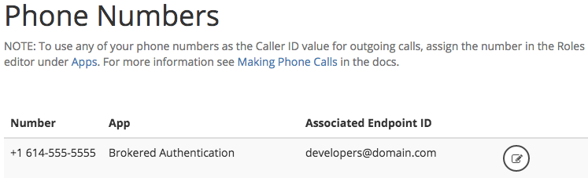

# Calling to and from a phone

You can use Respoke to call and receive calls from phones as well as other Respoke endpoints. In this tutorial, you will learn how to configure your app to accept phone calls and how to place calls to a phone.

### Assumptions

1. You have a Respoke account and an app ID.
2. You have configured your account and web server for [Brokered Authentication: Securing Your Application](/tutorials/brokered-auth.html).
3. You have [signed up for plan that includes a phone number](https://www.respoke.io/pricing/).
4. You have [created a role](/tutorials/roles-and-permissions.html).


### Step 1: Setting up your Role

In order to place calls to a phone number, your endpoint must be using a role which has PSTN (phone) calling enabled. This is done by specifying a phone number or group of phone numbers that the endpoint is allowed to call. Alternatively, you can specify "*" to allow calling to any phone number.


### Step 2: Calling a Phone Number

Now all you have to do is place a call. After your endpoint has logged into your app and authenticated to Respoke, use the following code to place a call to a phone number.

```javascript
client.startPhoneCall({
    number: "+15558675309"
});
```

To use caller id, use the phone number associated with your app and endpoint id. By default, Respoke will use the phone number associated with your account if no callerId is set:

```javascript
client.startPhoneCall({
    number: "+15558675309"
    callerId: "+15555555555"
});
```

In this example, whoever you call from your app will see (555) 555-5555 as the caller id. You can choose to have your callerId shown as "<Unknown>". Either pass an empty string or null:

```javascript
client.startPhoneCall({
    number: "+15558675309"
    callerId: ""
});
```

### Step 3: Receiving Calls at a Phone Number

To receive calls, you'll need a phone number, or DID, from Respoke. While phone calling is in beta, you can request a phone number by emailing [info@respoke.io](mailto:info@respoke.io).

You can manage a phone number in your [dev console](https://portal.respoke.io/) in the "Phone Numbers" section once it has been assigned to you. Just associate the phone number with an app and an endpoint, and you're done!



Then assign the phone number to an App Role:


Now if that endpoint is logged in via Respoke, calls to that phone number will be routed to that endpoint.

```javascript
client.listen('call', function (evt) {
  var call = evt.call;
  
  if (!call.caller) {
    if (call.toType === 'did') {
      var number = call.callerId.number;
      var name = call.callerId.name;
      
      call.answer();
    }
  }
});
```

Once the call event is triggered, you'll have access to a call event. Amongst other things, the call event is composed of a callerId object. This callerId object has several properties. Two properties you'll be interested in are the `number` property and the `name` property. 

The number property contains the phone number of the incoming caller. The name property contains the name of the phone number. The name property is set by either the caller's carrier or the caller. If either value is unavailable, it will be `null`.

Both outbound and inbound numbers follow the [E.164](http://en.wikipedia.org/wiki/E.164#DNS_mapping_of_E.164_numbers), international public telecommunication numbering plan, phone number format.
